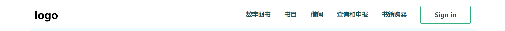

#  图书管理系统

###  项目介绍

通过 Vue.js + Django 搭建前后端分离的图书管理系统。

用于平时的制作与学习。

部分图书数据来自于微信读书和豆瓣阅读。


###  项目更新


* 2023-09-16

1. 实现登录注册功能，在可在客户端实现注册登录功能。
2. 实现图书数据的获取和刷新，书籍信息的分页展示
3. 实现图书的查询，用户书籍信息的添加（购买和借阅）
4. 个人用户书籍信息的查询（购买和借阅）


#  制作


###  网站设计

网站链接：[HappyFunCorp, a NYC-based Product Engineering Firm](https://happyfuncorp.com/#home)

参考页面：


####  栏目设计和内容

######  前端

* 首页（不必登录）

* 用户登录注册（一页）

* 书目（书籍列表）

  

  

######   后端

* 用户系统（内建用户，继承内部抽象类进行拓展）
* 书籍


####  项目规划


##  后端程序

* Python，Django，MySQL


> django-admin startproject end


###  数据库配置

```py
DATABASES = {
    'default': {
        'ENGINE': 'django.db.backends.mysql',
        'NAME': 'library',
        'USER': 'root',
        'PASSWORD': '149517',
        'HOST': '127.0.0.1',
        'POST': '3306'
    }
}
```


* 由于跨域，Cookie等问题的影响，重新建立一个后端系统，last-end


###   跨越处理-Django

####  使用模块

> pip install django-cors-headers


####  settings.py 配置

* 只对修改了并且关于跨域的部分进行展示

```py
INSTALLED_APPS = [
    'django.contrib.admin',
    'django.contrib.auth',
    'django.contrib.contenttypes',
    'django.contrib.sessions',
    'django.contrib.messages',
    'django.contrib.staticfiles',
    'corsheaders',
]

MIDDLEWARE = [
    'django.middleware.security.SecurityMiddleware',
    'django.contrib.sessions.middleware.SessionMiddleware',
    'django.middleware.common.CommonMiddleware',
    # 'django.middleware.csrf.CsrfViewMiddleware',
    'django.contrib.auth.middleware.AuthenticationMiddleware',
    'django.contrib.messages.middleware.MessageMiddleware',
    'django.middleware.clickjacking.XFrameOptionsMiddleware',
    'corsheaders.middleware.CorsMiddleware',
]

CORS_ALLOW_ALL_ORIGINS = True
CORS_ALLOW_CREDENTIALS = True
CORS_ORIGIN_WHITELIST = (
    ['http://127.0.0.1:*']
)

CORE_ALLOW_METHODS = ('DELETE', 'GET', 'POST', 'PUT')

CORS_ALLOW_HEADERS = (
    'XMLHttpRequest',
    'x_FILENAME',
    'accept-encoding',
    'authorization',
    'dnt',
    'origin',
    'user-agent',
    'x-csrftoken',
    'x-requested-with',
    'Pragma'
)
```


* 配置完成即可实现跨域


###  发送token

前后端分离的系统中，Django发送token也需要配置跨域

####  模块

> pip install djangorestframework 
>
> pip install djangorestframework-extensions

####  settings.py配置

* 保留对应的修改

```py
INSTALLED_APPS = [
    'django.contrib.admin',
    'django.contrib.auth',
    'django.contrib.contenttypes',
    'django.contrib.sessions',
    'django.contrib.messages',
    'django.contrib.staticfiles',
    'corsheaders',
    'rest_framework',
    'rest_framework.authtoken',
]

MIDDLEWARE = [
    'django.middleware.security.SecurityMiddleware',
    'django.contrib.sessions.middleware.SessionMiddleware',
    'django.middleware.common.CommonMiddleware',
    # 'django.middleware.csrf.CsrfViewMiddleware',
    'django.contrib.auth.middleware.AuthenticationMiddleware',
    'django.contrib.messages.middleware.MessageMiddleware',
    'django.middleware.clickjacking.XFrameOptionsMiddleware',
    'corsheaders.middleware.CorsMiddleware',
]

REST_FRAMEWORK = {
    'DEFAULT_AUTHENTICATION_CLASSES': (
        'rest_framework.authentication.TokenAuthentication',
        'rest_framework.authentication.SessionAuthentication',
    ),
}

```


####  在 views 中使用

```py
# dajngo 自己的用户表和内建的用户表
from django.contrib.auth.models import User
from user.models import UserInfo
# Django用户表的操作
from django.contrib.auth import authenticate, login

from django.http import JsonResponse
# token 
from rest_framework.authtoken.models import Token
from rest_framework.decorators import api_view, permission_classes
from rest_framework.response import Response
from rest_framework.permissions import IsAuthenticated


@api_view(['POST'])
def login_view(request):
	# 接受 POST 请求
    if request.method == "POST":
        username = request.POST.get('uname')
        password = request.POST.get('password')
		
        # 内置，比对用户名和密码
        user = authenticate(username=username, password=password)

        if user is not None:
            # 登录用户，login登录状态
            login(request, user)

            # 创建或获取 Token
            token, created = Token.objects.get_or_create(user=user)
            # 返回 Token 到客户端
            return JsonResponse({'code': 200, 'msg': '登录成功', 'token': token.key})
        else:
            # 身份验证失败，返回错误消息
            return JsonResponse({'code': 400, 'msg': '登录失败，用户名或密码错误'})


def register_view(request):

    if request.method == "POST":
        username = request.POST.get('uname')
        password = request.POST.get('password')
        password2 = request.POST.get('password2')

        # 1. 密码保持一致
        if password != password2:
            return JsonResponse({"msg": '密码输入不一致', "success": False})

        # 检查用户名是否已经存在
        if UserInfo.objects.filter(username=username).exists():
            return JsonResponse({'code': 200, 'msg': '用户名已经存在'})
        else:
            # 创建用户
            UserInfo.objects.create_user(username=username, password=password)
            return JsonResponse({'code': 201, 'msg': '用户创建成功'})

```


###  用户系统

* 通过 Django 内置的用户系统作为网站的用户系统
  * 处理方便，添加和删除等操作都有对应的指令完成
  * 对于密码等自动进行处理无需手动加密
  * 但是内置用户字段固定


####  继承抽象类进行创建

步骤

> 1. 添加新应用 -    `py manage.py startapp user`
> 2. 定义模型类，继承 AbstractUser
> 3. settings 中，指明` AUTH_USER_MODEL = ‘应用名.类名’`

**注意，此操作一定要在第一次 Migrate 之前**

```Python
from django.db import models
from django.contrib.auth.models import AbstractUser


class UserInfo(AbstractUser):
    career = models.CharField(max_length=24,default="")
```

* 在Django内置的字段基础上，添加了一个 career （职业）


####  数据迁移

> py manage.py makemigrations
>
> py manage.py migrate


####  用户添加

* user/views.py 
* 注册模块

```Python
def register_view(request):
    """
    :param request:
    :return: msg
    """
    if request.method == "POST":
        username = request.POST.get('uname')
        password = request.POST.get('password')
        password2 = request.POST.get('password2')

        # 1. 密码保持一致
        if password != password2:
            return JsonResponse({"msg": '密码输入不一致', "success": False})

        # 检查用户名是否已经存在
        if UserInfo.objects.filter(username=username).exists():
            return JsonResponse({'code': 200, 'msg': '用户名已经存在'})
        else:
            # 创建用户
            UserInfo.objects.create_user(username=username, password=password)
            return JsonResponse({'code': 201, 'msg': '用户创建成功'})
```


###  应用创建及数据模型

####  应用

> py manage.py startapp books;


####  图书数据模型

```py
from django.db import models


class Book(models.Model):
    bookname = models.CharField('书名', max_length=64)
    author = models.CharField("作者", max_length=64)
    isbn = models.CharField('ISBN', unique=True, max_length=20)
    Listing_time = models.DateTimeField("出版时间")
    updated_time = models.DateTimeField("添加时间", auto_now_add=True)
    type = models.CharField("类型", max_length=32)
    lang = models.CharField("语言", max_length=32)
    publisher = models.CharField("出版社", max_length=32)
    price = models.DecimalField("定价", max_digits=8, decimal_places=2)
    intro = models.CharField("描述", default="", max_length=512)
    # 封面来自微信读书链接，通过下载图片到服务器，通过ISBN进行索引
    pic = models.CharField("封面", default='',max_length=64)

```


####  数据返回

```py
from books.models import Book
from django.http import HttpResponse, JsonResponse


def all_view(request):
    # 接收 GET 请求
    if request.method == 'GET':
        # 查询所有数据
        # 在查询中使用了 .values() 方法来将查询结果转换为字典列表
        books = list(Book.objects.all().values())
        # 在数据前面添加一个code：200
        data = {
            'code': 200,
            'data': books
        }
        # 将 safe 参数设置为 False，因为我们返回的是一个列表，而不是一个字典。这允许返回一个非字典类型的 JSON 响应。
        # 将 json_dumps_params 参数设置为 {'ensure_ascii': False}，你告诉 Django 在将 Python 数据转换为 JSON 字符串时不要转义非 				ASCII 字符，这将确保中文字符正确地显示在返回的 JSON 中，而不会出现乱码。
        return JsonResponse(data, safe=False, json_dumps_params={'ensure_ascii': False})

```


###  分页查询

####  模块

> from django.core.paginator import Paginator
> from django.core import serializers
> import json

* Paginator，Django自带的分页查询工具
* serializeres，json，用于QuerySet对象的序列化，因为是前后端分离项目，返回JsonResponse对象时候需要进行序列化


####   原代码

* 直接返回所有的数据

```py
def all_view(request):
    if request.method == 'GET':
        books = list(Book.objects.all().values())
        data = {
            'code': 200,
            'books': books
        }
        return JsonResponse(data, safe=False, json_dumps_params={'ensure_ascii': False})
```


####  分页

```py
def all_view(request):
    # 数据获取
    books = Book.objects.all()
    # 分页，分页的数组，每页的数量
    paginator = Paginator(books, 4)

    # 获取 url 地址中的page，传递的第几页，如果没有page，则默认为1
    page_number = request.GET.get('page', 1)
   	# 获取 第 page 页内容
    page_obj = paginator.get_page(page_number)

    # 将QuerySet序列化为JSON格式
    serialized_data = serializers.serialize('json', page_obj)

    # 转换为Python数据结构
    data = json.loads(serialized_data)

    # 构建包含分页信息的字典
    pagination_info = {
        # 总数
        # 当前页
        # 是否有下一页
        # 是否有上一页
        "total_pages": paginator.num_pages,
        "current_page": page_obj.number,
        "has_next": page_obj.has_next(),
        "has_previous": page_obj.has_previous(),
    }

    return JsonResponse({"data": data, "pagination_info": pagination_info}, safe=False)
```


####  

##  前端程序

* Vite，Vue.js


> npm create vite@latest front -- --template vue


####  路由配置

######  main 

```js
import { createApp } from 'vue'
import './style.css'
import App from './App.vue'
import router from "./router/router.js";


const app = createApp(App)
app.use(router)

app.mount('#app')

```


######  router 路由

```js
import {createRouter, createWebHashHistory} from 'vue-router'
import Home from "../components/Home.vue";


const router = createRouter({
    history: createWebHashHistory(),
    routes: [
        {path: '/', component: Home},
    ],
})

export default router;
```


###  homePage

####  Nav



* 在链接处，添加鼠标经过底部横线滑入和滑出事件
* 在 `Sign in`处，添加一个鼠标经过颜色块填充的效果，同样是滑入滑出效果


####  效果实现

初步实现是通过`:hover`事件，但是还添加了动画 `aniamtion:leftIn .3s linear`

1. 在执行中，只添加了了一个进入动画，结束直接消失没有动画。

2. 所以打算使用反向的动画，但是只能是通过css只能添加进入效果

3. 添加 JS 动画，但是没有执行效果。

   ```vue
   methods:{
   	    spanAnimation(flag,index){
         let op = this.$refs.op[index-1];
         console.log(op)
         // if(op){
         //   console.log("元素没找到")
         //   return
         // }
         if(flag){
           op.style.animation = 'leftIn .3s linear forwards';
         }else{
           op.style.animation = 'leftIn .3s linear forwards';
           op.style.animationDirection = "alternate";
         }
       }
   }
   
   
   <div v-for="item in link" key="item.id" @mouseenter="spanAnimation(true,item.id)" 				      @mouseleave="spanAnimation(false,item.id)">
      <a :href="item.href">{{item.name}}</a>
      <span ref="op"></span>
   </div>
   ```

4. 在后续实践中，无法使用。事件无法触发

5. 故而采用，width和transition的方式实现动画

```vue
      div{
        position: absolute;
        top: 0;
        left: 0;
        z-index: -1;
        height: 100%;
        width: 0;
        background: $btnColor;
      }
    }
    .login:hover div{
      width: 100%;
    }
    .login:hover a{
      color: white;
    }
```


####  logo


###  login & register

* 最初是制作为两个不同的组件通过跳转的方式进行打开

* 但是出于对页面UI，页面动画效果的呈现

**使用的是将两个页面放在一起，通过页面中变量的切换实现不同额页面样式的展示**

1. 在register页面，midBox 会比 Login 页面高
2. 同时 form 内部同样变高
3. 而内部还多出一个密码输入框

####  页面


####  实现

1. 在点击右上角登录或者注册时候修改 this.login 的值，进行页面样式的修改
2. 输入框内容发生改变时候，触发watch，监听数据的长度，这里只是进行了长度的检查
3. 点击登录时候，取消了默认的提交操作
   * 取而代之的是对于内容的检查，此处只是设置了是否为空的检查
   * 不为空则会执行this.submitForm()
   * 接收参数，如果是login，则请求login接口
4. 在用户登录后，会接收到来自服务器的token，然后将其存储到浏览器中


####  代码

```vue
<script>
import {mapState} from "vuex";
import axios, {formToJSON, toFormData} from "axios";
export default {
  computed: {
    ...mapState(['baseUrl'])
  },
  data() {
    return {
      // 是否是登录页面
      login: true,
      uname: '',
      password: "",
      password2: "",
      // 输入提示
      unameTip: "",
      passwordTip: "",
      password2Tip: "",
      // 控制密码可见
      psV: true,
      ps2V: true,
    }
  },
  methods: {
    Jump() {
      this.login = !this.login;
      let mid = document.querySelector('.mid');
      let btn = document.querySelectorAll('label')[2];

      if (!this.login) {
        mid.classList.add('res_mid')
      } else {
        mid.classList.remove('res_mid')
      }
    },
    submitForm(type) {
      let url = this.baseUrl + '/user/'
      let formData = new FormData();
      formData.append('uname', this.uname);
      formData.append('password', this.password);
      if (type === 'login') {
        url = url + 'login/';
        this.axiosLogin(url, formData)
      }
      if (type === 'register') {
        url = url + 'register/';
        formData.append('password2', this.password2);
        this.axiosRegister(url, formData)
      }
    },
    axiosLogin(url, formData) {
      axios
          .post(url,formData)
          .then(res => {
            console.log(res.data)
            if (res.data.code === 200) {
              localStorage.setItem('token', res.data.token);
              localStorage.setItem('pic', res.data.pic)
              this.$store.commit('setName', this.uname)
              this.$store.commit('setPicUrl', res.data.pic)
              this.$router.push('/')
            } else {
              alert(res.data.msg)
            }
          })
          .catch(err => {
            console.log("数据提交失败" + err)
          })
    },
    axiosRegister(url, formData) {
      axios
          .post(url, formData)
          .then(res => {
            if (res.data.code === 201) {
              if (confirm(res.data.msg + "，是否直接登录")) {
                this.submitForm('login')
              } else {
                this.login = false;
              }
            } else {
              alert(res.data.msg)
            }
          })
          .catch(err => {
            console.log("数据提交失败" + err)
          })
    }
  },
  watch: {
    uname(newValue) {
      if (newValue.length < 4) {
        this.unameTip = '用户名过短'
      } else if (newValue.length > 30) {
        this.unameTip = '用户名过长'
      } else {
        this.unameTip = ""
      }
    },
    // password 略
  }
}

</script>

<template>
  <div class="container">
    <div class="mid">
      <div class="left">
        
      </div>
      <div class="right">
        <div class="login_bg">
          <div class="top">
            <div class="head">
              <router-link to="/">返回首页</router-link>
              <a href="javascript:void(0)" @click="Jump()" v-if="login">注册</a>
              <a href="javascript:void(0)" @click="Jump()" v-else>登录</a>
            </div>
            <h2 v-if="login">用户登录</h2>
            <h2 v-else>注册新用户</h2>
          </div>
          <form :action="baseUrl+'/user/login/'" ref="login" method="post" v-if="login"
                @submit.prevent="check('login')">
            <div class="box">
              <label>
                账号：<input type="text" v-model="uname" name="uname" id="uname">
              </label>
              <div>{{ unameTip }}</div>
            </div>
            <div class="box">
              <label class="pass">
                密码：<input :type="psV ? 'password' : 'text' " v-model="password" name="password" id="password">
                <div @click="psV = !psV">
                  
                  
                </div>
              </label>
              <div>{{ passwordTip }}</div>
            </div>
            <label>
              <button id="submit" type="submit">登录</button>
            </label>
          </form>
        </div>

      </div>
    </div>
  </div>
</template>

```


###  书目


####  分页数据展示

> 现存问题，因为数据量较少，没有考虑数据过多时候的按钮切换效果

* 通过按钮点击传递数据
* 通过`disabled`控制按钮是否能够点击

#####  代码

```html
      <div class="paging">
        <button :disabled="!pagination_info.has_previous" @click="fixPage('up')">上一页</button>
        <button class="li" :class="{'li_active': pagination_info.current_page === (index+1)}"
                v-for="(item,index) in pagination_info.total_pages"
                @click="fixPage(index+1)">{{ index + 1 }}
        </button>
        <button @click="fixPage('down')" :disabled="!pagination_info.has_next">下一页</button>
      </div>
```


#####  整体实现

* 通过data数据，监听page的修改，修改后就发送一次请求，获取当页的数据

```vue
<script>
import axios from "axios";
import {mapState} from "vuex";

export default {
  data() {
    return {
      pagination_info: {
        total_pages: 0,
        current_page: 0,
        has_next: true,
        has_previous: false
      },
      page: 1,
    }
  },
  methods: {
    getBooks() {
      let url = this.baseUrl + `/books/all/?page=${this.page}`
      axios.get(url)
          .then((res) => {
            this.books = res.data.data
            this.pagination_info = res.data.pagination_info
          })
          .catch((err) => {
            console.log("数据请求失败" + err)
          })
    },
    fixPage(type){
      if(type === 'up'){
        if(this.page === 1){
          return false
        }else {
          this.page = this.page -1
        }
      }else if(type === 'down'){
        if(this.page === 3){
          return false
        }else {
          this.page = this.page + 1
        }
      }else{
        this.page = type
      }
    }
  },
  watch:{
    page(newValue){
      this.getBooks()
    }
  },
  mounted() {
    this.getBooks()
  }
}
</script>

<template>
  <div class="container">
    <div class="bg">
      <div class="box">
        <div class="line" v-for="item in books" key="item.id">
          <!==数据==>
        </div>
      </div>
      <div class="paging">
        <button :disabled="!pagination_info.has_previous" @click="fixPage('up')">上一页</button>
        <button class="li" :class="{'li_active': pagination_info.current_page === (index+1)}"
                v-for="(item,index) in pagination_info.total_pages"
                @click="fixPage(index+1)">{{ index + 1 }}
        </button>
        <button @click="fixPage('down')" :disabled="!pagination_info.has_next">下一页</button>
      </div>
    </div>
  </div>
</template>
```


##  数据库

* Mysql


> create database library charset=utf8;


###  书籍信息添加（手动）


**使用的是 Django的admin后台管理系统**

####  超级用户的创建

`py manage.py createsuperuser`


####  将自己的类注册到后台管理界面

**注册步骤**

1. 在应用 app 中的 `admin.py` 中导入注册要管理的models类，如 `from .models import Book`
2. 调用 `admin.site.register` 方法进行注册，如 `admin.site.register` (自定义模型类)

```py
from django.contrib import admin

from .models import Book


admin.site.register(Book)
```

